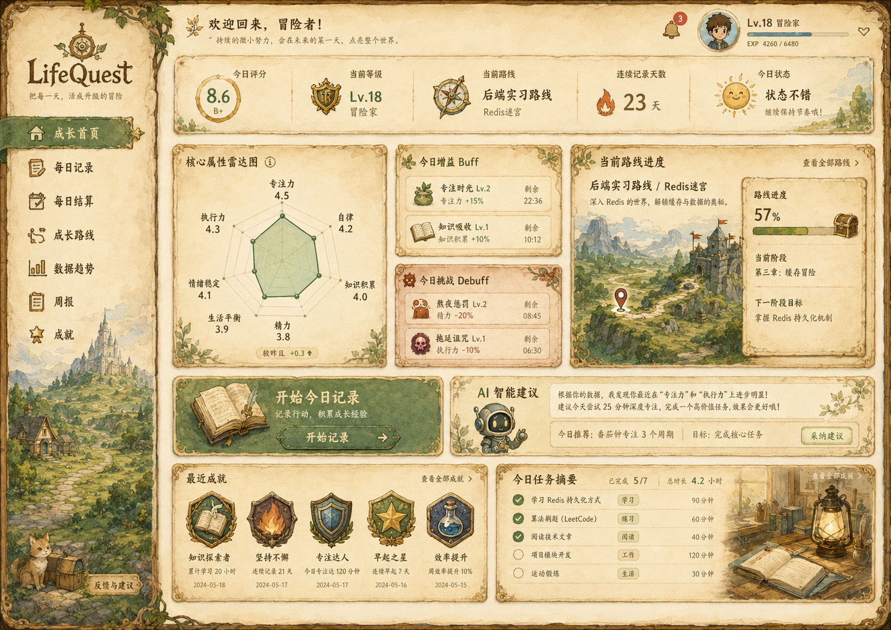
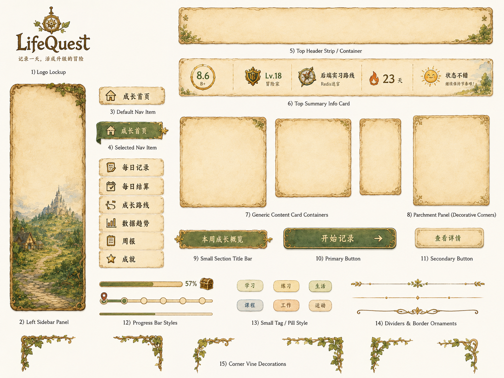
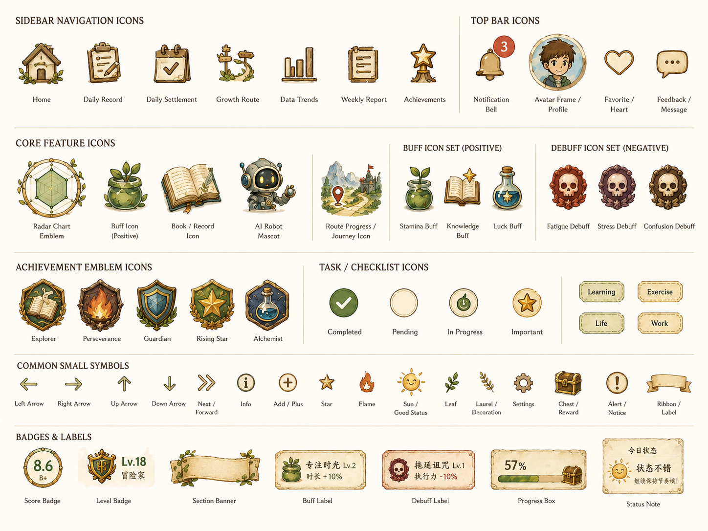
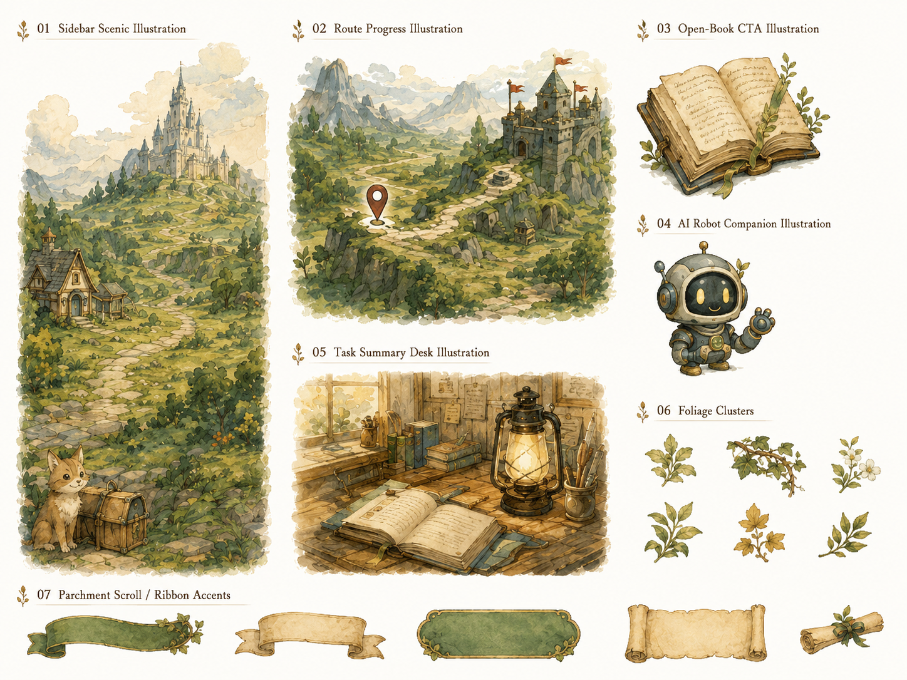
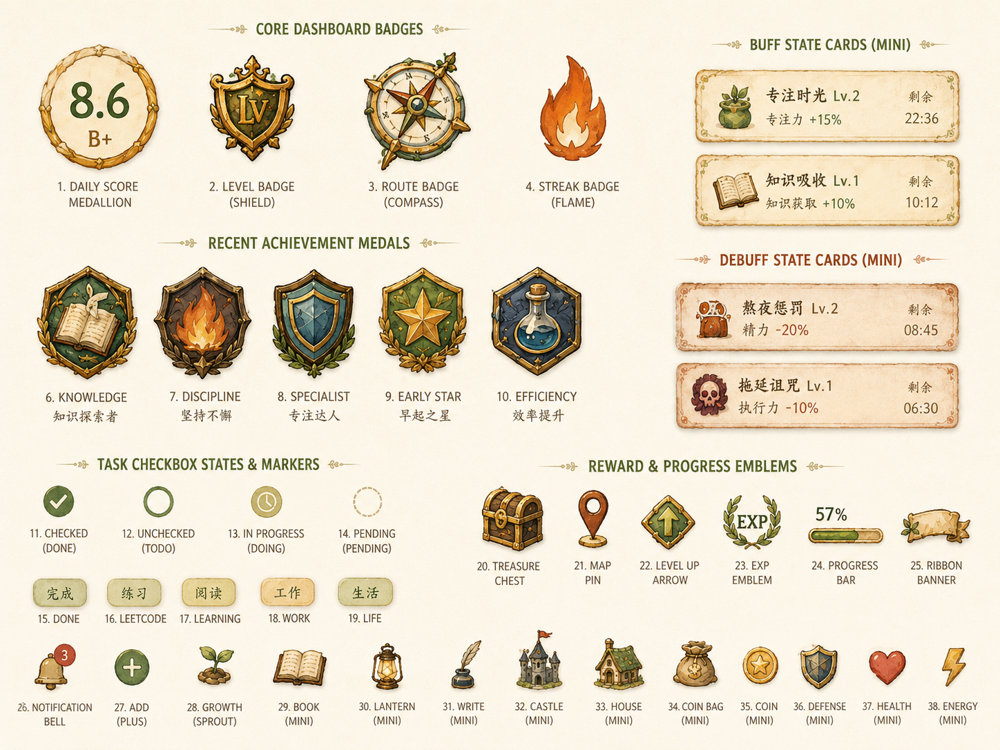

# LifeQuest Frontend Dashboard Reference

创建日期：2026-06-09

## 设计图

## 页面素材

以下素材可用于支撑成长首页的前端视觉实现：

## 可实现性结论

该设计可以实现，适合作为 LifeQuest 成长首页的高保真视觉方向参考。

本次补充的页面素材可以帮助实现该设计，尤其适合用于：

- 固定整体美术方向：羊皮纸、手绘边框、绿色主导航、RPG 徽章、成长路线地图。
- 复刻基础 UI：顶部信息条、侧边栏、导航项、卡片容器、按钮、标签、进度条、装饰分割线。
- 搭建核心内容：属性雷达图、Buff / Debuff 列表、路线进度、AI 建议区、任务摘要、最近成就。
- 提供插画占位：侧边栏场景图、路线地图、打开的书、AI 机器人、任务书桌等。

当前素材主要是完整素材板，适合作为视觉参考和临时展示素材。正式开发时，如果希望页面更精细、可维护，建议继续切分为独立资源。

设计中的核心区域都能映射到现有产品模块：

- 左侧导航：成长首页、每日记录、每日结算、成长路线、数据趋势、周报、成就。
- 顶部用户状态：头像、等级、经验条、通知。
- 今日概览：今日评分、当前等级、当前路线、连续记录天数、今日状态。
- 核心属性雷达图：对应 `focus`、`discipline`、`knowledge`、`energy`、`mood`、`execution`、`balance`。
- Buff / Debuff：对应游戏化事件模块。
- 路线进度：对应成长路线和用户路线进度。
- AI 智能建议：对应 LLM 反馈和规则降级建议。
- 最近成就：对应成就系统。
- 今日任务摘要：对应明日任务/任务模块。

## 实现建议

- 第一版前端可先实现布局、数据卡片、雷达图、任务列表和事件列表。
- 手绘地图、徽章、边框、羊皮纸纹理、机器人插画等视觉资源建议先使用静态图片或轻量素材占位。
- 雷达图可使用 ECharts 实现。
- 侧边栏、卡片和按钮可以用 CSS 复刻羊皮纸、绿色布面、木质边框等视觉氛围。
- 桌面端优先按该图实现；移动端建议改为顶部导航 + 单列卡片流，避免信息过密。

## 素材使用策略

- UI 容器、按钮、标签和进度条：优先用 CSS 实现结构和状态，素材板用于确定颜色、边框和阴影风格。
- 图标、徽章、Buff / Debuff、插画：优先使用独立透明 PNG / WebP；如果暂时没有切图，可先从素材板裁切。
- 大插画区域：侧边栏场景图、路线地图、任务书桌、AI 机器人可作为静态图片直接嵌入。
- 雷达图和进度数据：必须由前端组件根据后端数据渲染，不建议使用静态图片替代。

## 后续推荐补充素材

为了更高质量地进入前端实现阶段，建议后续提供：

- 独立透明背景图片：导航图标、顶部图标、Buff / Debuff 图标、徽章、宝箱、火焰、机器人、路线地图。
- 九宫格或可拉伸边框素材：卡片容器、顶部信息条、按钮、侧边栏面板。
- 背景纹理：无文字、可平铺的羊皮纸背景和轻微纸张噪声纹理。
- 状态素材：按钮默认、悬停、按下、禁用；导航默认、选中；任务已完成、进行中、未完成。
- 尺寸规范：每个图标建议提供 1x / 2x，常用尺寸可按 24、32、48、64、96、128 px 分组。

## 风险点

- 一比一复刻手绘插画成本较高，需要专门资产或 AI 生成素材。
- 信息密度高，移动端不能直接照搬桌面布局。
- 字体、边框、图标、徽章和地图如果全部自绘，会显著增加前端工作量。

## MVP 落地策略

1. 先实现信息架构和可交互页面。
2. 再统一视觉主题：羊皮纸背景、绿色主导航、RPG 卡片边框。
3. 最后替换高质量插画、徽章和地图资产。
